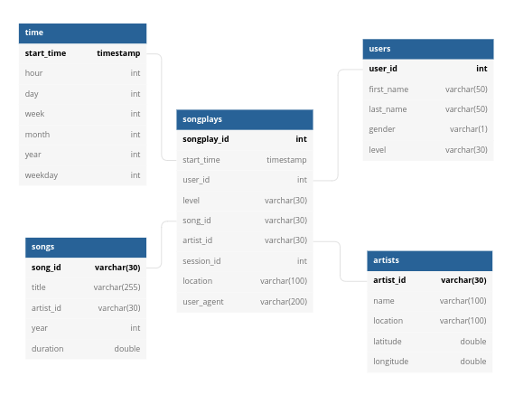
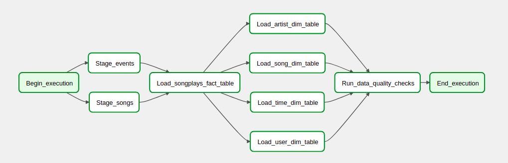

# Project: Data Pipelines 
## Introduction
A music streaming company, Sparkify, has decided that it is time to introduce more automation and monitoring to their data warehouse ETL pipelines and come to the conclusion that the best tool to achieve this is Apache Airflow.

They want a data engineer to create high grade data pipelines that are dynamic and built from reusable tasks, can be monitored, and allow easy backfills. They have also noted that the data quality plays a big part when analyses are executed on top of the data warehouse and want to run tests against their datasets after the ETL steps have been executed to catch any discrepancies in the datasets.

The source data resides in S3 and needs to be processed in Sparkify's data warehouse in Amazon Redshift. The source datasets consist of JSON logs that tell about user activity in the application and JSON metadata about the songs the users listen to.

## File Structure

```
.Project Folder
├── dags
│   ├── sparkify_dag.py
|   ├── sql_queries.py
├── logs
├── plugins
│   ├── operators ├── data_quality.py
|   |             ├── load_dimension.py 
|   |             ├── load_fact.py 
|   |             ├── stage_to_redshift.py 
├── create_tables.sql
```

## Data Modeling
Two staging tables will be used in Redshift to hold the data extracted from S3. These include:
- staging_events
- staging_songs

The schema for this project has been modeled using the star schema. This wil allow optimized queries for analysis. The tables include:
1. Fact Table: 
- songplays - records in log data associated with song plays 
2. Dimension Tables
- users - users in the app
- songs - songs in music database
- artists - artists in music database
- time - timestamps of records in songplays broken down into specific units




## ETL Pipeline
The ETL pipeline is managed using Airflow. Data is extracted from the json files located in S3. This data is processed, cleaned, and inserted into the fact and dimension tables. 



## How to Run this Project
1. Create a Redshift Cluster on AWS. 
2. Copy the scripts from create_tables.sql and run them on the Redshift Query editor.
3. Copy the files from the Project folder into the airflow folder
4. Open the airflow UI on the browser
5. Configure airflow variables:
- aws_access_key: Your AWS Access Key
- aws_secret_key: Your AWS Secred Key	
6. Configure airflow connection to Redshift:
- Connection Id: redshift
- Connection Type: Postgres
- Schema: 
- Login:
- Password:
- Port: 5439
7. Navigate to DAGs on Airflow UI and start the DAG sparkify_dag


